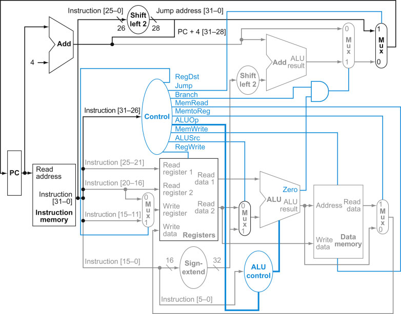
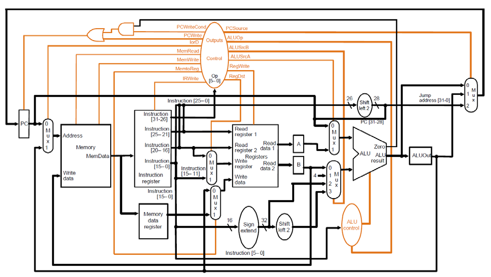

# MIPS CPU

## Single-Cycle

### Supported Instructions

- R-Type
    - add
    - sub
    - and
    - or
    - xor
    - nor
    - slt
    - srl*
    - jr
    - jalr
- I-Type:
    - addi
    - andi
    - ori
    - xori
    - lui
    - lw
    - sw
    - beq
    - bne
    - slti
- J-Type:
    - J
    - Jal*

## Multi-Cycle

### Supported Instructions

- R-Type
    - add
    - sub
    - and
    - or
    - xor
    - nor
    - slt
    <!-- - srl* -->
- I-Type:
    - addi
    - andi
    - ori
    - xori
    - lui
    - lw
    - sw
    - beq
    - bne
    - slti
- J-Type:
    - J

### Tutorial

- <https://homepage.cs.uiowa.edu/~ghosh/6016.90.pdf>
- <https://github.com/DTV96Calibre/sc-mips>
- controls - <http://www.pitt.edu/~kmram/CoE0147/lectures/datapath3.pdf>
- AluOp - <https://www.u-aizu.ac.jp/~yliu/teaching/comparch/lab4.html>

## Multi-Cycle

- <https://syssec.ethz.ch/content/dam/ethz/special-interest/infk/inst-infsec/system-security-group-dam/education/Digitaltechnik_14/21_Architecture_MultiCycle.pdf>
