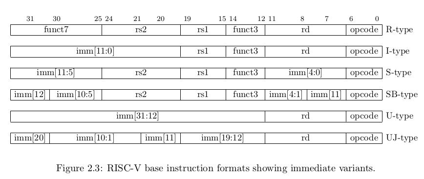
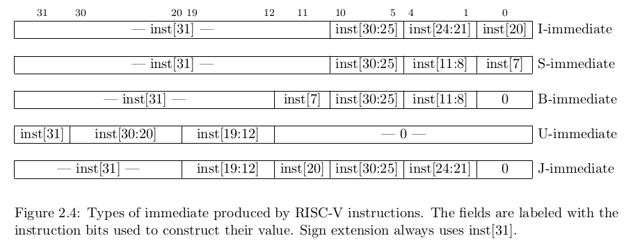
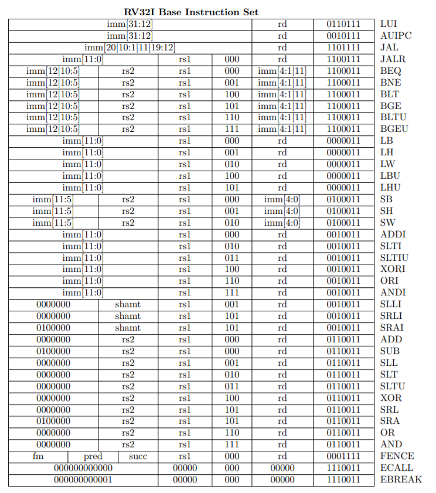

# RISC V

## Sodor

- <https://docs.google.com/document/d/1WPQblOoKIODLrIacFSumXR6_uC9zquyixNFN8ABVQxY/edit>

## Instructions

- <https://inst.eecs.berkeley.edu/~cs61c/resources/su18_lec/Lecture7.pdf>
    - instruction types
- 
    - R-type
        - Arithmetics
            - add rd, rs1, rs2
                - rd <- rs1 <?> rs2
    - I-type
        - Arithmetics
            - addi rd, rs1, imm
                - rd <- rs1 <?> imm
        - load
            - lw rd, imm(rs1)
                - rd <- mem[rs1 + imm]
        - jalr
            - jalr rd, imm(rs1)
                - rd <- pc + 4
                - pc <- rs1 + imm
            - pseudo
                - jr rs | jalr x0, 0(rs) | Jump register
                - jalr rs | jalr x1, 0(rs) | Jump and link register
                - ret | jalr x0, 0(x1) | Return from subroutine
    - S-type
        - store
            - sw rs2, imm(rs1)
                - mem[rs1 + imm] <- rs2
    - SB-type
        - conditional branch
            - beq rs1, rs2, label/offset
                - pc <- pc + offset
    - U-type
        - Dealing With Large Immediates
        - LUI (load upper immediate)
            - lui rd, imm
                - rd <- imm
    - UJ-type
        - jal rd, label/indirect_imm
            - rd <- pc + 4
            - pc <- pc + indirect_imm
- 
- 

## 1stage

Modifications on the diagram:

- Add component `ShamtSignExtend32b` with output `shamtSignExtend`
- Add constant `0` to the input of `op2Sel`
- Add `shamtSignExtend` to the input of `op1Sel`

## 5stage

Modifications on the diagram:

- Remove component `<< 1` next to the Branch & Jump TargGen
    - since the left shift 1 operation has already been done in `BTypeSignExtend` and `JTypeSignExtend`
- Remove component `<< 12` next to `Op2Sel`
    - since the left shift 12 operation has already been done in `ITypeSignExtend`
- PC stage register between fetch and decode stages takes `PC` rather than `PC + 4`
- Add component `ShamtSignExtend32b` with output `shamtSignExtend`
- Add component `STypeSignExtend32b` with output `sTypeSignExtend`
- `Branch & Jump TargGen` is wrapped as component `BranchAndJumpTargGen`
- `JumpRegTargGen` still used in Execute Stage
- Currently not implementing anything relative to data hazard
