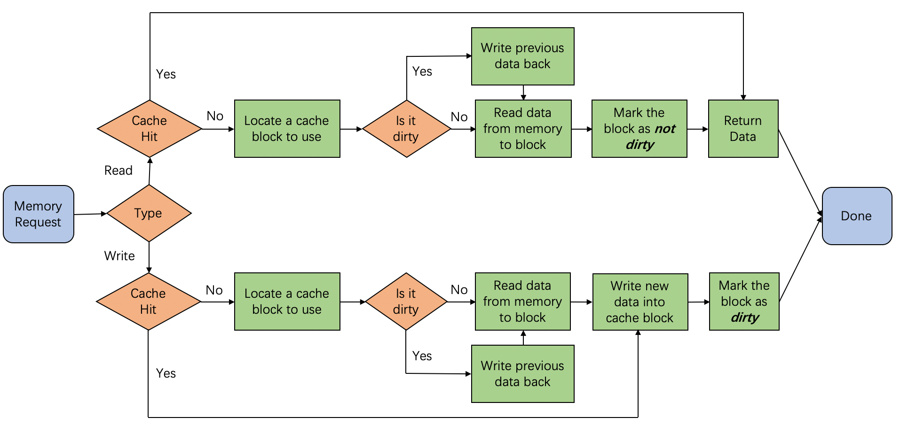
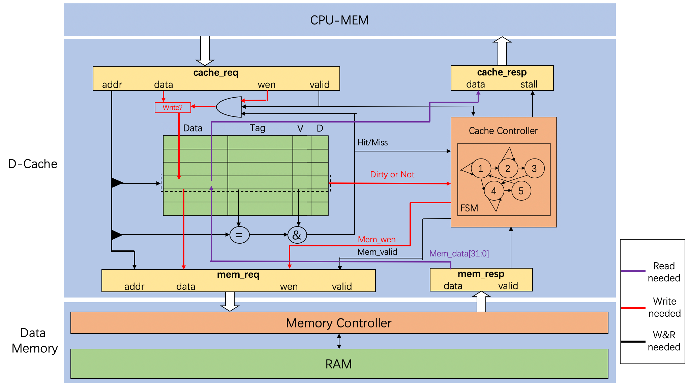
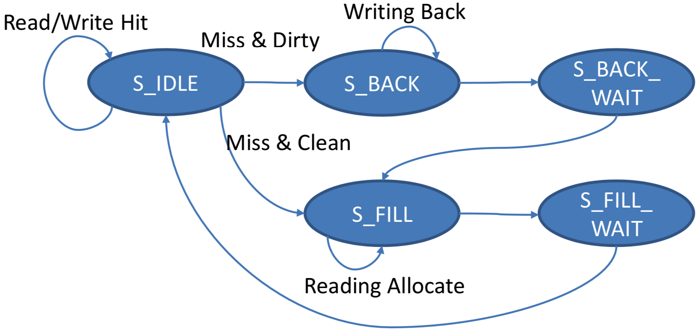

# Cache

## Modifications

-   
    -   the `Cache Controller` has not been adopted.
    -   Logic in D-Cache has been rewritten.
-   
    -   new state `S_FILL_WRITE` for data write to cache after allocation.
