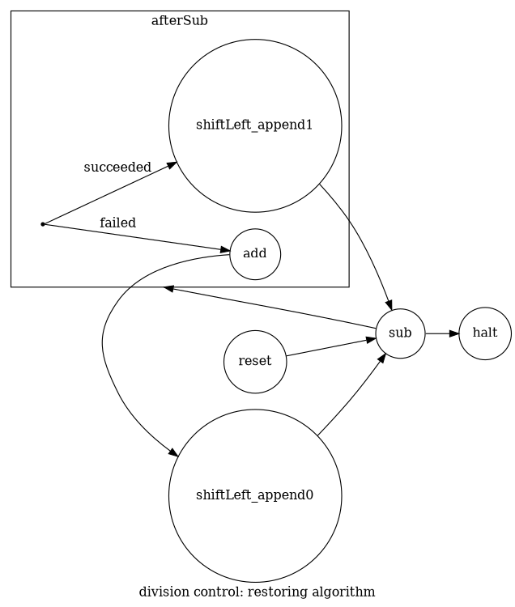

```graphviz
digraph state_machine {
    label="division control: restoring algorithm";
    rankdir=LR;
    size="8,5"
    compound=true;

    node [shape = circle];

    subgraph cluster_afterSub {
        label = "afterSub";
        afterSub[shape="none"][style="invis"][label=""];
        cluster_afterSub_start [shape = point];
        add;
        shiftLeft_append1;

        cluster_afterSub_start -> add [label="failed"];
        cluster_afterSub_start -> shiftLeft_append1 [label="succeeded"];
    };
    reset -> sub;
    sub -> afterSub [lhead="cluster_afterSub"];
    sub -> halt;

    add -> shiftLeft_append0;
    shiftLeft_append0 -> sub;

    shiftLeft_append1 -> sub;
}
```
