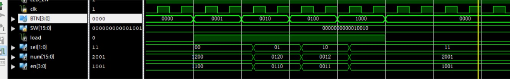
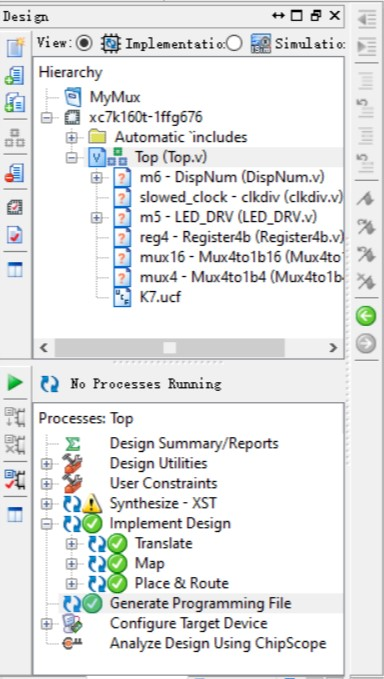

# 第一周课堂实验：MUX多路选择器

## 设计目的

完成一个 MUX 的多路选择器，并应用于实际

## 设计思路

### MUX 模块


```verilog
module Mux2to1(
    a,  // candidate
    b,  // candidate
    ctrl,  // control
    s  // final selection
);

    input wire a;
    input wire b;
    input wire ctrl;
    output wire s;

    wire sel1, sel2;

    and(sel1, a, ~ctrl);
    and(sel2, b, ctrl);
    or(s, sel1, sel2);

endmodule // Mux2to1
```

### Top 模块

首先先设计一个一个MUX，能够在4个备选输入中选择一个作为输出。

在数字输出的设计中，将四种可能的情况列举

```verilog
// cases for being selected by MUX
wire [15:0] num1 = {SW[7:0], 8'b0};
wire [15:0] num2 = {4'b0, SW[7:0], 4'b0};
wire [15:0] num3 = {8'b0, SW[7:0]};
wire [15:0] num4 = {SW[3:0], 8'b0, SW[7:4]};
```

将button的输入持久化（保存）

```verilog
// BTN recording
wire load = |BTN;
wire [3:0] sel_decoded;
Register4b reg4(clk, load, BTN, sel_decoded);
```

将button的输入编码，转化成MUX能够识别的控制端输入格式

```verilog
// encode selective option from BTN
wire [1:0] sel;
assign sel[0] = sel_decoded[3] | sel_decoded[1];
assign sel[1] = sel_decoded[3] | sel_decoded[2];
```

最后构造MUX，输出选择的结果

```verilog
// mux 16bit 4to1
Mux4to1b16 mux16(sel, num1, num2, num3, num4, num);
```

## 实验过程

1. 复用”数字逻辑设计“课上的模块，重新熟悉 ISE 软件的操作
1. 编写 Top.v 顶层模块
1. 编写 Top_tb.v 激励模块
1. 生成波形图，重点关注 MUX 功能的实现
1. 生成bit文件

## 运行截图

对Top模块激励的波形图如下



项目编译情况如下



最终电路示意图


